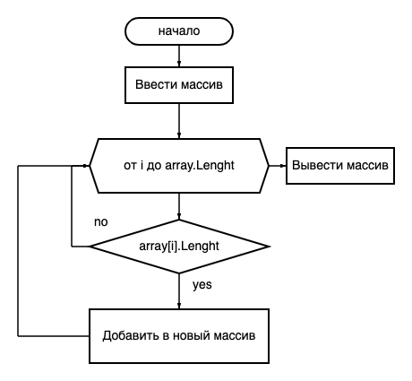

# Описание решения задания

### Шаг 1: ввод массива строк с клавиатуры

Пользователь вводит массив строк с клавиатуры. Необходимо реализовать проверку на пустую строку, а также выход из ввода с помощью нащатия клавиши **q**

### Шаг 2: Цикл прохода по массиву

Необходимо пройтись циклом по массиву, проверив каждый элемент на размер. Если размер строки меньше или равен 3, необходимо добавить элемент в новый массив.

Пример создания динамического массива:
```
int length = 0;
int [] numbers = new int [5] {1,2,3,4,5};
length = numbers.Length; //5
Array.Resizeint>(ref numbers, 7);
// либо так
// Array.Resize(ref numbers, numbers.Length + 2);
length = numbers.Length; //7
Результат: {1,2,3,4,5,0,0} //- элементы
```

### Шаг 3: вывести итоговый массив в консоль

Вывести полученный массив в консоль

### Блок схема

